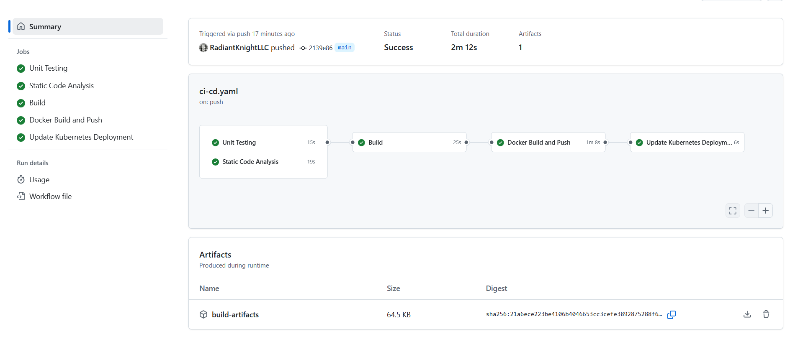

## Application Overview

The Tic-Tac-Toe app provides an engaging experience with a clean, minimalist interface, allowing players to enjoy the classic game of tic-tac-toe right in their browser. Leveraging the powerful combination of React for a component-driven architecture and TypeScript for type safety, this app is both performant and maintainable.

## Multi-Environment Configuration

Our application is designed to operate seamlessly across multiple environments:

- **Development**:

  - Frequent deployments with minimal resource allocation
  - Debugging tools and verbose logging enabled
  - Automatic reloading for rapid testing and feedback
  - Namespace: `tictactoe-dev`
  - Resource limits: 0.5 CPU, 512Mi memory

- **Staging**:

  - Near-production environment for final testing and validation
  - Mirrors production settings without affecting live operations
  - Connected to test databases and services
  - Namespace: `tictactoe-staging`
  - Resource limits: 1 CPU, 1Gi memory

- **Production**:
  - Optimized for performance and stability
  - Enhanced security measures and monitoring
  - Scaled for handling real user traffic
  - Namespace: `tictactoe-prod`
  - Resource limits: 2 CPU, 2Gi memory

## CI/CD Pipeline

Integrated with GitHub Actions, our CI/CD pipeline automates testing, building, and deploying processes. The pipeline ensures every change is rigorously tested across all environments:

- **Continuous Integration**:

  - Automatically runs unit tests and static analysis
  - Enforces code quality with ESLint and Prettier
  - Validates TypeScript types and builds the application
  - Runs on every pull request and commit to main branch

  

- **Continuous Deployment**:

  - Uses Docker to build and push images to GHCR (GitHub Container Registry)
  - Tags images with commit SHA and environment name
  - Deploys to Kubernetes using Kustomize
  - Progressive deployment strategy: dev → staging → production
  - Automated rollbacks if health checks fail

- **Security**:
  - Incorporates Trivy vulnerability scans for container images
  - Dependency scanning with Dependabot
  - Secret scanning to prevent credential leaks
  - SAST (Static Application Security Testing) integration

## Technology Stack

- **Frontend**: React with Vite for fast, efficient development experiences.
- **Type Safety**: TypeScript offers a robust framework for type checking and improved code quality.
- **CI/CD**: GitHub Actions orchestrates a reliable build and deployment process, from code push to production.

## Get Started

Clone the repository and follow setup instructions to run the application locally or explore its features online. Contributions are welcome—please refer to our coding guidelines for a cohesive development approach.
